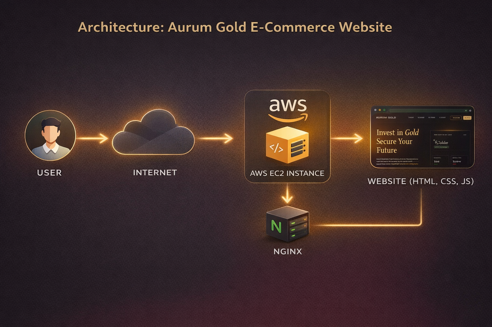
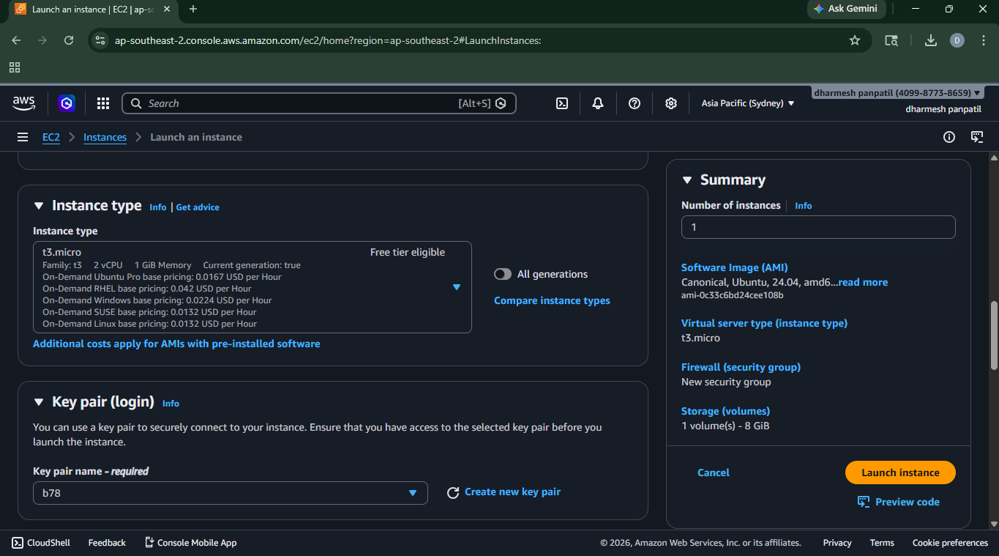
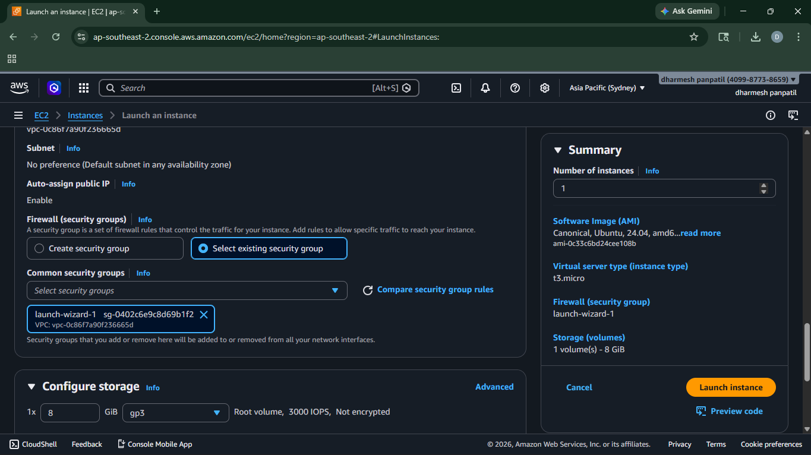
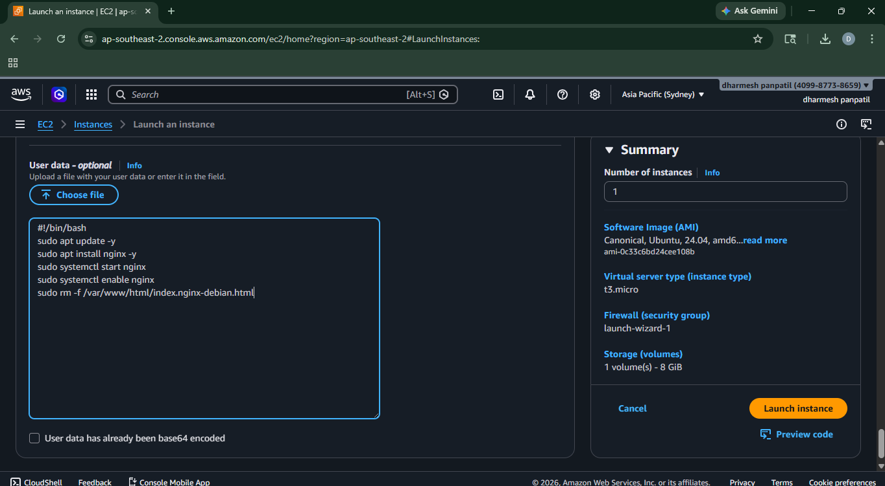
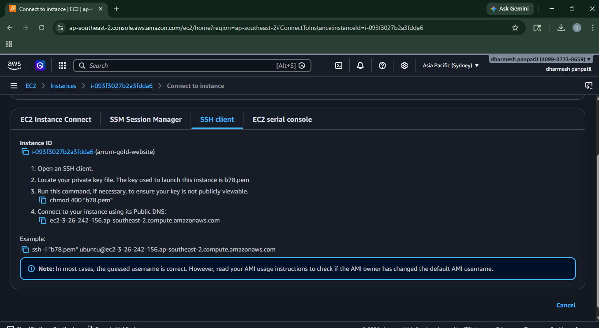
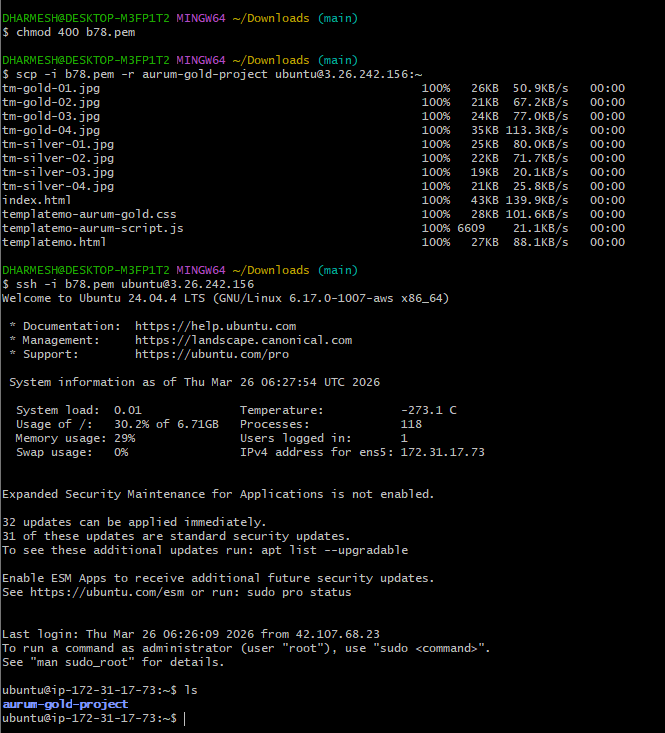
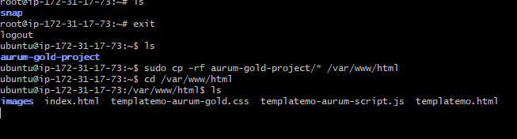

# 🪙 Aurum Gold - AWS Deployed E-Commerce Website

## 📌 Project Overview

This project is a **modern commercial/e-commerce website** deployed on AWS EC2 using Nginx.

It demonstrates real-world cloud deployment, server setup, and hosting a professional website.

---

## 🛠️ Technologies Used

### 💻 Frontend

* HTML5
* CSS3
* JavaScript

### ☁️ Cloud & DevOps

* AWS EC2 (Ubuntu 24.04)
* Nginx Web Server
* SSH (Secure Shell)
* SCP (File Transfer)

### 🧰 Tools

* Git Bash
* Git & GitHub

---

## ⚙️ Features

✔ Professional UI design
✔ Responsive layout
✔ Product showcase
✔ Smooth scrolling
✔ Mobile navigation menu
✔ Interactive components

---

## 🏗️ Architecture Diagram

---

## 📂 Project Structure

aurum-gold-project/

* index.html
* templatemo-aurum-gold.css
* templatemo-aurum-script.js
* setup.sh
* README.md
* architecture.png
* images/
* screenshots/

---

## 🚀 Deployment Steps

### 1️⃣ Connect to Server

ssh -i b78.pem ubuntu@3.26.242.156

---

### 2️⃣ Upload Project

scp -i b78.pem -r aurum-gold-project ubuntu@3.26.242.156:~

---

### 3️⃣ Move Files

sudo cp -rf aurum-gold-project/* /var/www/html/

---

### 4️⃣ Restart Server

sudo systemctl restart nginx

---

## 📸 Screenshots

### ☁️ AWS EC2 Setup

---

### ⚙️ Instance Configuration

---

### 🔐 Security Group

---

### 🧾 User Data Script

---

### 🔗 SSH Connection

---

### 📤 File Upload (SCP)

---

### 📂 Server Files

---

### 🌐 Website Output

---

## 🔥 Key Learnings

* AWS EC2 setup
* SSH connection
* File transfer using SCP
* Nginx configuration
* Website deployment

---

## 👨‍💻 Author

Dharmesh Panpatil

---

## ⭐ Conclusion

This project demonstrates **real-world AWS deployment and DevOps skills**, making it a strong portfolio project.
