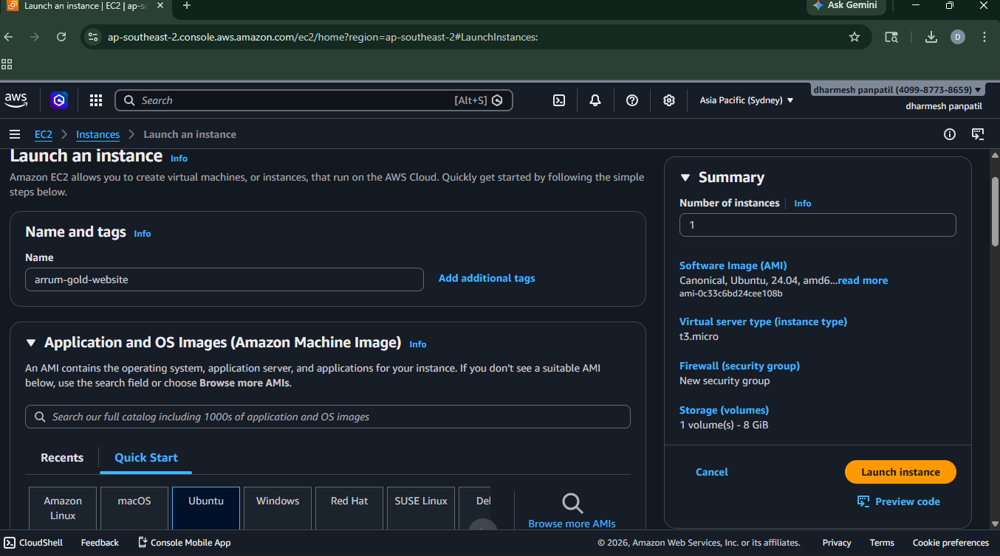

# 🪙 Aurum Gold - AWS Deployed E-Commerce Website

## 📌 Project Overview

This project is a **modern commercial/e-commerce website** deployed on AWS EC2 using Nginx.

It demonstrates real-world cloud deployment, server setup, and hosting a professional website.

---

## 🛠️ Technologies Used

### 💻 Frontend

* HTML5
* CSS3
* JavaScript

### ☁️ Cloud & DevOps

* AWS EC2 (Ubuntu 24.04)
* Nginx Web Server
* SSH (Secure Shell)
* SCP (File Transfer)

### 🧰 Tools

* Git Bash
* Git & GitHub

---

## ⚙️ Features

✔ Professional UI design
✔ Responsive layout
✔ Product showcase
✔ Smooth scrolling
✔ Mobile navigation menu
✔ Interactive components

---

## 🏗️ Architecture

User → Internet → AWS EC2 → Nginx → Website


---

## 📂 Project Structure

```
aurum-gold-project/
│
├── index.html
├── templatemo-aurum-gold.css
├── templatemo-aurum-script.js
├── setup.sh
├── README.md
│
├── images/
└── screenshots/
```

---

## 🚀 Deployment Steps

### 1️⃣ Launch EC2 Instance

* Ubuntu Server
* Instance type: t2.micro
* Allow ports:

  * 22 (SSH)
  * 80 (HTTP)

---

### 2️⃣ Connect to Server

```
ssh -i b78.pem ubuntu@3.26.242.156
```

---

### 3️⃣ Upload Project Files

```
scp -i b78.pem -r aurum-gold-project ubuntu@3.26.242.156:~
```

---

### 4️⃣ Move Files to Web Server

```
sudo cp -rf aurum-gold-project/* /var/www/html/
```

---

### 5️⃣ Restart Nginx

```
sudo systemctl restart nginx
```

---

## 📸 Screenshots

### 🌐 Website Output


---

### ☁️ AWS EC2 Setup



---

### ⚙️ Instance Configuration


---

### 🔐 Security Group & Storage


---

### 🧾 User Data Script


---

### 🔗 SSH Connection


---

### 📤 File Upload (SCP)


---

### 📂 Files in Server


---

## 🔥 Key Learnings

* How to launch AWS EC2 instance
* How to connect using SSH
* How to upload files using SCP
* How to configure Nginx
* How to deploy a live website

---

## 🎯 Future Improvements

* Add backend (Node.js / Django)
* Add database (MySQL)
* Add authentication (Login/Signup)
* Add payment integration
* Add custom domain + HTTPS

---

## 👨‍💻 Author

Dharmesh Panpatil

---

## ⭐ Conclusion

This project demonstrates **real-world cloud deployment and DevOps skills**, making it a strong addition to a portfolio or resume.

---
